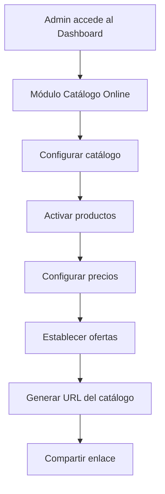
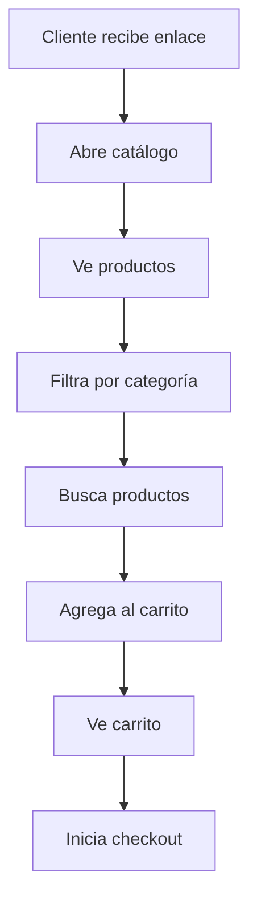
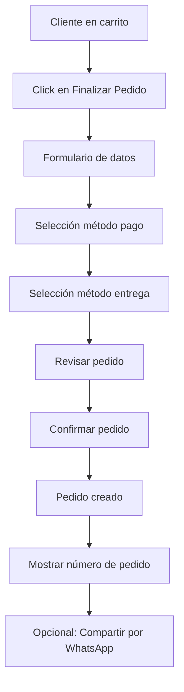
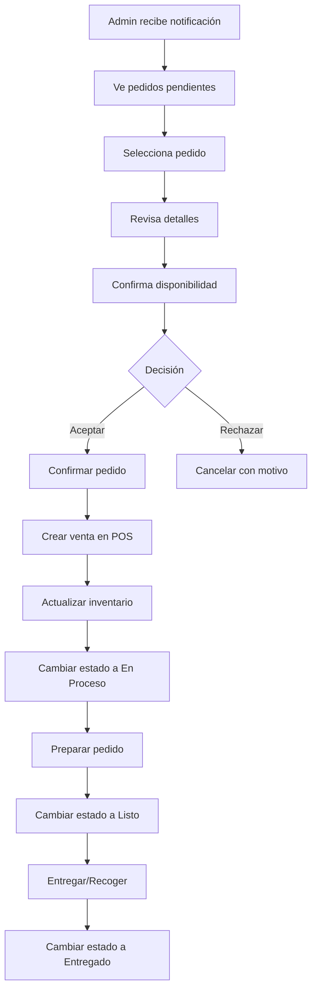
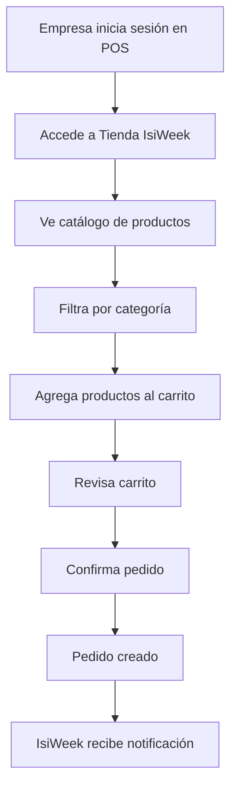
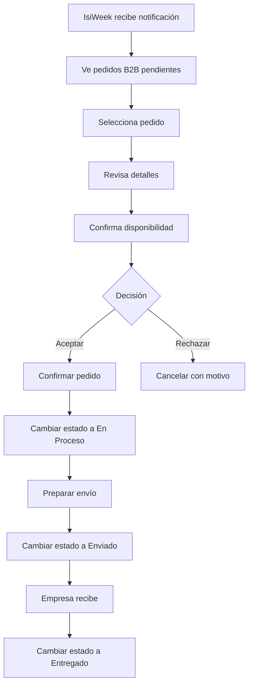

# 📦 Metodología de Implementación: Catálogo Online + Tienda B2B para Sistema POS IsiWeek

## 📋 Resumen Ejecutivo

**Objetivo:** Implementar dos funcionalidades complementarias integradas al sistema POS:
1. **Catálogo Online B2C**: Mini e-commerce para que los negocios muestren sus productos y reciban pedidos de clientes finales
2. **Tienda B2B**: Tienda privada donde IsiWeek vende insumos, equipos y servicios directamente a las empresas clientes

**Propósito:** 
- Permitir a las empresas mostrar sus productos públicamente mediante enlaces compartibles (WhatsApp, Instagram, QR, etc.)
- Recibir pedidos que se integran automáticamente al sistema POS como ventas pendientes o pedidos para despacho
- Crear un canal de ventas adicional para IsiWeek como proveedor (insumos, equipos, servicios)

**Impacto:** 
- Mejora la experiencia del cliente final (B2C)
- Aumenta las ventas mediante canales digitales
- Automatiza la recepción de pedidos
- Crea ingresos recurrentes para IsiWeek (B2B)
- Diferencia el producto de otros POS del mercado
- Posiciona a IsiWeek como proveedor tecnológico completo

---

## 🔍 Conceptos Clave: B2C vs B2B

### 🟢 B2C (Business to Consumer) - Empresa → Consumidor Final

**Definición Simple:**
B2C es cuando un negocio vende directamente a una persona común (consumidor final), no a otra empresa.

**En palabras simples:**
"Un negocio le vende a un cliente final."

**Ejemplos Reales:**

1. **Tienda de Barrio**
   - El negocio: Bodega Don Pepe
   - El cliente: Juan (persona común)
   - Compra: arroz, gaseosa, azúcar
   - **👉 Eso es B2C**

2. **Restaurante**
   - El negocio: Pollería El Dorado
   - El cliente: Familia que pide almuerzo
   - Canal: mostrador / WhatsApp / web
   - **👉 B2C**

3. **E-commerce**
   - Amazon → compra una persona
   - Mercado Libre → compra una persona
   - Tienda online de una marca → compra una persona
   - **👉 B2C**

**Analogía Simple:**
🍕 **Pizzería**
- Negocio: Pizzería
- Cliente: Persona que pide pizza
- Canal: WhatsApp / Web
- **Tipo: B2C**

Si la pizzería vende una pizza a una persona → B2C

**Aplicado a IsiWeek - Catálogo Online:**
```
Cliente Final (Juan)
    ↓
Catálogo Online (Barra 4 Vientos)
    ↓
Pedido
    ↓
POS del Negocio
```
👉 El negocio vende directamente al consumidor final → **B2C**

---

### 🔵 B2B (Business to Business) - Empresa → Empresa

**Definición Simple:**
B2B es cuando una empresa vende productos o servicios a otra empresa, no a consumidores finales.

**En palabras simples:**
"Una empresa le vende a otra empresa."

**Ejemplos Reales:**

1. **Proveedor a Tienda**
   - IsiWeek → Restaurantes
   - Proveedor de insumos → Tienda
   - **👉 B2B**

2. **Distribuidor a Negocio**
   - Distribuidor de bebidas → Supermercado
   - Mayorista → Minorista
   - **👉 B2B**

**Analogía Simple:**
🧃 **Jugos**
- Bodega compra jugos al proveedor → **B2B**
- Persona compra jugo en la bodega → **B2C**

**Aplicado a IsiWeek - Tienda B2B:**
```
IsiWeek (Proveedor)
    ↓
Tienda B2B (Privada)
    ↓
Pedido
    ↓
Empresa Cliente (Barra 4 Vientos)
```
👉 IsiWeek vende directamente a empresas → **B2B**

---

### ⚖️ Diferencias Clave

| Aspecto | B2C | B2B |
|---------|-----|-----|
| **Cliente** | Persona común | Otra empresa |
| **Volumen** | Compras pequeñas/individuales | Compras grandes/volumen |
| **Relación** | Transaccional | Relacional |
| **Precios** | Precio al público | Precios negociados/volumen |
| **Canal** | Público (web, redes) | Privado (login requerido) |
| **Ejemplo IsiWeek** | Catálogo Online del negocio | Tienda IsiWeek para empresas |

---

### 🎯 Modelo Mixto en IsiWeek

El sistema propuesto implementa **ambos modelos simultáneamente**:

1. **B2C**: Catálogo Online - El negocio vende a clientes finales
2. **B2B**: Tienda IsiWeek - IsiWeek vende a empresas clientes

**Ventaja:** 
- Doble valor agregado
- Múltiples fuentes de ingresos
- Ecosistema completo integrado

---

## 🎯 Visión General - Propuesta Funcional

### ¿Qué quiere el cliente del POS?

El cliente del POS quiere que:

1. 👉 Sus productos del POS se puedan mostrar online
2. 👉 Compartirlos fácilmente por WhatsApp, Instagram o QR
3. 👉 Que el consumidor haga pedidos sin llamar
4. 👉 Que esos pedidos entren directo al POS
5. 👉 Y además, que IsiWeek le venda insumos y equipos desde el mismo sistema

### Solución: Dos Funcionalidades Complementarias

Esto se logra creando **DOS funcionalidades complementarias**:

🟢 **Catálogo Online para sus clientes finales (B2C)**
🔵 **Tienda privada B2B (IsiWeek → Empresas)**

**Importante:** No son tiendas separadas. **Todo vive dentro del POS IsiWeek**.

---

## 🎯 Alcance del Proyecto

### Funcionalidades Principales

1. **Catálogo de Productos Público**
   - Visualización de productos con imágenes
   - Filtrado por categorías
   - Búsqueda de productos
   - Precios y ofertas visibles

2. **Gestión Administrativa**
   - Activar/desactivar productos en catálogo
   - Configurar precios y ofertas
   - Gestión de disponibilidad
   - Autorización de productos visibles

3. **Carrito de Compras**
   - Agregar/quitar productos
   - Calcular totales
   - Aplicar descuentos
   - Persistencia local

4. **Proceso de Pedido**
   - Información del cliente
   - Métodos de pago
   - Opciones de entrega
   - Integración con POS

5. **Gestión de Pedidos (POS)**
   - Recepción automática de pedidos
   - Confirmación y procesamiento
   - Estados de pedido
   - Despacho/recogida

---

## 🏗️ Arquitectura del Sistema

### Diagrama de Flujo General

```
┌─────────────────────────────────────────────────────────────┐
│                    SISTEMA POS (Existente)                   │
│                                                              │
│  ┌──────────────┐      ┌──────────────┐                    │
│  │  Dashboard   │      │   Productos  │                    │
│  │  Admin       │──────│   (BD POS)   │                    │
│  └──────────────┘      └──────────────┘                    │
│         │                      │                            │
│         │                      │                            │
│         ▼                      ▼                            │
│  ┌──────────────────────────────────────┐                  │
│  │  Módulo Catálogo Online (Nuevo)      │                  │
│  │  - Activar/Desactivar productos      │                  │
│  │  - Configurar precios catálogo       │                  │
│  │  - Gestión de ofertas                │                  │
│  └──────────────────────────────────────┘                  │
└─────────────────────────────────────────────────────────────┘
                        │
                        │ API / Rutas
                        ▼
┌─────────────────────────────────────────────────────────────┐
│              CATÁLOGO PÚBLICO (Frontend)                     │
│                                                              │
│  ┌──────────────┐  ┌──────────────┐  ┌──────────────┐     │
│  │  Catálogo    │  │   Carrito    │  │   Checkout   │     │
│  │  Productos   │──│   Compras    │──│   Pedido     │     │
│  └──────────────┘  └──────────────┘  └──────────────┘     │
└─────────────────────────────────────────────────────────────┘
                        │
                        │ Crear Pedido
                        ▼
┌─────────────────────────────────────────────────────────────┐
│            INTEGRACIÓN CON POS (Backend)                     │
│                                                              │
│  ┌──────────────────────────────────────┐                  │
│  │  Módulo Pedidos Online               │                  │
│  │  - Crear pedido en BD POS            │                  │
│  │  - Notificaciones                    │                  │
│  │  - Gestión de estados                │                  │
│  └──────────────────────────────────────┘                  │
└─────────────────────────────────────────────────────────────┘
```

### Componentes del Sistema

#### 1. **Backend (Node.js + Next.js Server Actions)**
- Gestión de catálogo
- API de productos públicos
- Procesamiento de pedidos
- Integración con BD POS

#### 2. **Frontend Público (Next.js + React)**
- Páginas de catálogo
- Carrito de compras
- Proceso de checkout
- Responsive design

#### 3. **Base de Datos (MySQL)**
- Tablas nuevas para catálogo online
- Integración con tablas existentes
- Relaciones entre entidades

#### 4. **Sistema POS (Existente)**
- Recepción de pedidos
- Gestión de ventas
- Control de inventario
- Dashboard administrativo

---

## 🏗️ Arquitectura de las Dos Funcionalidades

### Visión Integrada

```
┌─────────────────────────────────────────────────────────────────┐
│                    SISTEMA POS ISIWEEK (Existente)               │
│                                                                  │
│  ┌──────────────────┐        ┌──────────────────┐              │
│  │   Dashboard      │        │    Productos     │              │
│  │   Admin          │────────│    (BD POS)      │              │
│  └──────────────────┘        └──────────────────┘              │
│         │                              │                        │
│         │                              │                        │
│         ├──────────────────────────────┼────────────────────┐  │
│         │                              │                    │  │
│         ▼                              ▼                    ▼  │
│  ┌──────────────────────────────────────────────────────────┐ │
│  │  MÓDULOS NUEVOS INTEGRADOS                                │ │
│  │                                                            │ │
│  │  🟢 CATÁLOGO ONLINE B2C        🔵 TIENDA B2B ISIWEEK      │ │
│  │  - Activar productos          - Productos IsiWeek         │ │
│  │  - Configurar precios         - Pedidos B2B               │ │
│  │  - Gestión de ofertas         - Gestión IsiWeek           │ │
│  │  - Pedidos B2C                - Notificaciones            │ │
│  └──────────────────────────────────────────────────────────┘ │
└─────────────────────────────────────────────────────────────────┘
                        │                    │
                        │                    │
        ┌───────────────┘                    └───────────────┐
        │                                                  │
        ▼                                                  ▼
┌──────────────────────┐              ┌──────────────────────┐
│  CATÁLOGO PÚBLICO    │              │  TIENDA PRIVADA B2B  │
│  (B2C)               │              │  (Solo Empresas)     │
│                      │              │                      │
│  /c/{slug}           │              │  /tienda-isiweek     │
│  - Clientes finales  │              │  - Login requerido   │
│  - Sin registro      │              │  - Empresas activas  │
│  - Público           │              │  - Privado           │
└──────────────────────┘              └──────────────────────┘
```

### Separación de Funcionalidades

#### 🟢 Catálogo Online B2C
- **Acceso:** Público (sin login)
- **Cliente:** Consumidor final
- **Productos:** Del negocio (tabla `productos` existente)
- **URL:** `/c/{slug-empresa}`
- **Pedidos:** Se integran al POS del negocio

#### 🔵 Tienda B2B IsiWeek
- **Acceso:** Privado (login requerido)
- **Cliente:** Empresas registradas en IsiWeek
- **Productos:** De IsiWeek (tabla nueva `isiweek_productos`)
- **URL:** `/tienda-isiweek` o `/b2b`
- **Pedidos:** Se procesan por IsiWeek (admin)

---

## 📊 Modelo de Datos

### Tablas Nuevas Requeridas

#### 1. `catalogo_config`

```sql
CREATE TABLE catalogo_config (
    id INT PRIMARY KEY AUTO_INCREMENT,
    empresa_id INT NOT NULL,
    nombre_catalogo VARCHAR(255),
    descripcion TEXT,
    logo_url VARCHAR(500),
    color_primario VARCHAR(50),
    color_secundario VARCHAR(50),
    activo BOOLEAN DEFAULT TRUE,
    url_slug VARCHAR(255) UNIQUE,
    fecha_creacion DATETIME DEFAULT CURRENT_TIMESTAMP,
    fecha_actualizacion DATETIME DEFAULT CURRENT_TIMESTAMP ON UPDATE CURRENT_TIMESTAMP,
    
    FOREIGN KEY (empresa_id) REFERENCES empresas(id) ON DELETE CASCADE,
    INDEX idx_empresa (empresa_id),
    INDEX idx_slug (url_slug)
) ENGINE=InnoDB DEFAULT CHARSET=utf8mb4;
```

**Propósito:** Configuración general del catálogo por empresa.

**Campos clave:**
- `url_slug`: Identificador único para la URL del catálogo (ej: "barra4vientos")
- `activo`: Controla si el catálogo está disponible públicamente
- `color_primario/secundario`: Personalización visual

---

#### 2. `productos_catalogo`

```sql
CREATE TABLE productos_catalogo (
    id INT PRIMARY KEY AUTO_INCREMENT,
    producto_id INT NOT NULL,
    empresa_id INT NOT NULL,
    visible_catalogo BOOLEAN DEFAULT FALSE,
    precio_catalogo DECIMAL(10,2),
    precio_oferta DECIMAL(10,2),
    fecha_inicio_oferta DATETIME,
    fecha_fin_oferta DATETIME,
    destacado BOOLEAN DEFAULT FALSE,
    orden_visual INT DEFAULT 0,
    descripcion_corta TEXT,
    stock_visible BOOLEAN DEFAULT TRUE,
    activo BOOLEAN DEFAULT TRUE,
    fecha_creacion DATETIME DEFAULT CURRENT_TIMESTAMP,
    fecha_actualizacion DATETIME DEFAULT CURRENT_TIMESTAMP ON UPDATE CURRENT_TIMESTAMP,
    
    FOREIGN KEY (producto_id) REFERENCES productos(id) ON DELETE CASCADE,
    FOREIGN KEY (empresa_id) REFERENCES empresas(id) ON DELETE CASCADE,
    INDEX idx_producto (producto_id),
    INDEX idx_empresa (empresa_id),
    INDEX idx_visible (visible_catalogo, activo),
    INDEX idx_destacado (destacado, activo)
) ENGINE=InnoDB DEFAULT CHARSET=utf8mb4;
```

**Propósito:** Extiende la tabla `productos` existente con información específica del catálogo online.

**Campos clave:**
- `visible_catalogo`: Controla si el producto aparece en el catálogo público
- `precio_catalogo`: Precio específico para el catálogo (puede diferir del precio POS)
- `precio_oferta`: Precio promocional
- `destacado`: Productos destacados en la página principal
- `orden_visual`: Control del orden de aparición

**Relación:** 1:1 con tabla `productos` existente

---

#### 3. `pedidos_online`

```sql
CREATE TABLE pedidos_online (
    id INT PRIMARY KEY AUTO_INCREMENT,
    numero_pedido VARCHAR(50) UNIQUE,
    empresa_id INT NOT NULL,
    cliente_nombre VARCHAR(255),
    cliente_telefono VARCHAR(50),
    cliente_email VARCHAR(255),
    cliente_direccion TEXT,
    metodo_pago ENUM('efectivo', 'transferencia', 'tarjeta', 'contra_entrega') DEFAULT 'contra_entrega',
    metodo_entrega ENUM('pickup', 'delivery') DEFAULT 'pickup',
    subtotal DECIMAL(10,2) NOT NULL,
    descuento DECIMAL(10,2) DEFAULT 0,
    impuesto DECIMAL(10,2) DEFAULT 0,
    total DECIMAL(10,2) NOT NULL,
    estado ENUM('pendiente', 'confirmado', 'en_proceso', 'listo', 'entregado', 'cancelado') DEFAULT 'pendiente',
    notas TEXT,
    venta_id INT NULL,
    fecha_pedido DATETIME DEFAULT CURRENT_TIMESTAMP,
    fecha_confirmacion DATETIME NULL,
    fecha_actualizacion DATETIME DEFAULT CURRENT_TIMESTAMP ON UPDATE CURRENT_TIMESTAMP,
    
    FOREIGN KEY (empresa_id) REFERENCES empresas(id) ON DELETE CASCADE,
    FOREIGN KEY (venta_id) REFERENCES ventas(id) ON DELETE SET NULL,
    INDEX idx_empresa (empresa_id),
    INDEX idx_estado (estado),
    INDEX idx_fecha (fecha_pedido),
    INDEX idx_numero (numero_pedido)
) ENGINE=InnoDB DEFAULT CHARSET=utf8mb4;
```

**Propósito:** Almacena los pedidos realizados desde el catálogo online.

**Campos clave:**
- `numero_pedido`: Identificador único del pedido (formato: PED-YYYYMMDD-XXX)
- `venta_id`: Relación con la tabla `ventas` cuando el pedido se convierte en venta
- `estado`: Flujo de estados del pedido
- `metodo_pago/entrega`: Opciones seleccionadas por el cliente

---

#### 4. `pedidos_online_items`

```sql
CREATE TABLE pedidos_online_items (
    id INT PRIMARY KEY AUTO_INCREMENT,
    pedido_id INT NOT NULL,
    producto_id INT NOT NULL,
    cantidad INT NOT NULL,
    precio_unitario DECIMAL(10,2) NOT NULL,
    descuento DECIMAL(10,2) DEFAULT 0,
    subtotal DECIMAL(10,2) NOT NULL,
    fecha_creacion DATETIME DEFAULT CURRENT_TIMESTAMP,
    
    FOREIGN KEY (pedido_id) REFERENCES pedidos_online(id) ON DELETE CASCADE,
    FOREIGN KEY (producto_id) REFERENCES productos(id) ON DELETE CASCADE,
    INDEX idx_pedido (pedido_id),
    INDEX idx_producto (producto_id)
) ENGINE=InnoDB DEFAULT CHARSET=utf8mb4;
```

**Propósito:** Almacena los productos de cada pedido online.

**Relación:** N:1 con `pedidos_online`

---

### Integración con Tablas Existentes

#### Tabla `productos` (Existente)

**Campos utilizados:**
- `id`
- `nombre`
- `descripcion`
- `precio_venta`
- `precio_oferta`
- `imagen_url`
- `categoria_id`
- `stock`
- `activo`
- `empresa_id`

**Extensión:**
- Tabla `productos_catalogo` agrega funcionalidad específica del catálogo online
- No modifica la estructura existente
- Mantiene compatibilidad con el POS actual

#### Tabla `ventas` (Existente)

**Uso:**
- Cuando un pedido online se confirma, se crea una venta asociada
- Campo `pedido_online_id` (opcional, agregar si no existe) para rastrear origen

#### Tabla `empresas` (Existente)

**Uso:**
- Cada empresa tiene su propio catálogo
- Configuración por empresa
- URL única por empresa

---

## 🔄 Flujos de Trabajo

### Flujo 1: Configuración del Catálogo (Administrador)



**Pasos detallados:**

1. **Acceso al módulo:**
   - Admin → Dashboard → "Catálogo Online"
   - Ver configuración actual del catálogo

2. **Configuración inicial:**
   - Nombre del catálogo
   - Descripción
   - Logo (opcional)
   - Colores (opcional)
   - Activar catálogo público

3. **Gestión de productos:**
   - Lista de todos los productos
   - Toggle "Visible en catálogo"
   - Configurar precio del catálogo (puede diferir del precio POS)
   - Configurar precio de oferta
   - Marcar como destacado
   - Ordenar visualmente

4. **Generación de URL:**
   - Formato: `https://isiweek.com/c/{slug-empresa}`
   - Ejemplo: `https://isiweek.com/c/barra4vientos`
   - El slug se genera automáticamente o es configurable

5. **Compartir:**
   - Copiar enlace
   - Generar QR code
   - Compartir en redes sociales

---

### Flujo 2: Visualización del Catálogo (Cliente)



**Pasos detallados:**

1. **Acceso:**
   - Cliente recibe enlace (WhatsApp, email, QR, etc.)
   - No requiere login/registro
   - Página pública y responsive

2. **Navegación:**
   - Vista de productos en grid o lista
   - Filtros por categoría
   - Búsqueda por nombre
   - Ordenamiento (precio, nombre, destacados)

3. **Visualización de producto:**
   - Imagen del producto
   - Nombre y descripción
   - Precio (y precio de oferta si aplica)
   - Estado de stock (opcional)
   - Botón "Agregar al carrito"

4. **Carrito de compras:**
   - Persistencia en localStorage
   - Actualización en tiempo real
   - Cálculo de totales
   - Modificar cantidades
   - Eliminar productos

---

### Flujo 3: Proceso de Pedido (Cliente)



**Pasos detallados:**

1. **Checkout:**
   - Formulario de datos del cliente:
     - Nombre completo
     - Teléfono
     - Email (opcional)
     - Dirección (si delivery)

2. **Opciones de pago:**
   - Contra entrega
   - Efectivo
   - Transferencia
   - Tarjeta (futuro)

3. **Opciones de entrega:**
   - Pickup (recoger en tienda)
   - Delivery (entrega a domicilio)

4. **Confirmación:**
   - Resumen del pedido
   - Total a pagar
   - Información de contacto

5. **Creación del pedido:**
   - Se guarda en BD
   - Se genera número de pedido único
   - Notificación al admin

6. **Confirmación al cliente:**
   - Pantalla de confirmación
   - Número de pedido
   - Instrucciones de seguimiento
   - Opción de compartir por WhatsApp

---

### Flujo 4: Procesamiento del Pedido (Administrador)



**Pasos detallados:**

1. **Recepción:**
   - Notificación en dashboard
   - Lista de pedidos pendientes
   - Indicador visual de nuevos pedidos

2. **Revisión:**
   - Detalles completos del pedido
   - Productos solicitados
   - Datos del cliente
   - Método de pago y entrega

3. **Validación:**
   - Verificar disponibilidad de productos
   - Verificar stock
   - Validar información del cliente

4. **Confirmación:**
   - Aceptar pedido → Crear venta en POS
   - Rechazar pedido → Notificar al cliente (opcional)

5. **Procesamiento:**
   - Crear venta en tabla `ventas`
   - Crear detalles en tabla `detalle_ventas`
   - Actualizar stock
   - Asociar pedido con venta

6. **Gestión de estados:**
   - **Pendiente:** Recién recibido
   - **Confirmado:** Aceptado por admin
   - **En Proceso:** Preparando
   - **Listo:** Listo para entrega/recoger
   - **Entregado:** Completado
   - **Cancelado:** Rechazado o cancelado

---

### Flujo 5: Tienda B2B - Visualización (Empresa Cliente)



**Pasos detallados:**

1. **Acceso:**
   - Empresa debe estar registrada y activa en IsiWeek
   - Usuario debe iniciar sesión
   - Aparece opción "Tienda IsiWeek" en el menú

2. **Navegación:**
   - Catálogo de productos de IsiWeek
   - Filtros por categoría (Consumibles, Equipos, Accesorios, etc.)
   - Búsqueda de productos
   - Precios visibles (puede incluir precio volumen)

3. **Carrito:**
   - Agregar productos al carrito
   - Modificar cantidades
   - Ver totales
   - Aplicar precios volumen si corresponde

4. **Checkout:**
   - Información de la empresa (pre-llenada)
   - Selección de método de pago
   - Agregar observaciones
   - Confirmar pedido

---

### Flujo 6: Tienda B2B - Procesamiento (IsiWeek Admin)



**Pasos detallados:**

1. **Recepción:**
   - Notificación en dashboard de IsiWeek
   - Email automático
   - Lista de pedidos B2B pendientes

2. **Revisión:**
   - Detalles del pedido
   - Empresa solicitante
   - Productos solicitados
   - Total del pedido

3. **Procesamiento:**
   - Validar disponibilidad de productos
   - Confirmar pedido
   - Preparar productos
   - Actualizar estados

4. **Facturación:**
   - Generar factura (opcional)
   - Registrar pago
   - Actualizar stock de IsiWeek

---

## 🛠️ Módulos a Desarrollar

### Módulo 1: Gestión de Catálogo (Backend + Frontend Admin)

#### Backend (`_Pages/admin/catalogo/`)

**Archivos:**
- `servidor.js`: Server actions para gestión del catálogo
- `productos/servidor.js`: Gestión de productos en catálogo
- `pedidos/servidor.js`: Gestión de pedidos online

**Funciones principales:**

```javascript
// catalogo/servidor.js
export async function obtenerConfigCatalogo() {
    // Obtener configuración del catálogo de la empresa
}

export async function actualizarConfigCatalogo(datos) {
    // Actualizar configuración del catálogo
}

export async function generarUrlCatalogo() {
    // Generar o actualizar URL slug del catálogo
}

// productos/servidor.js
export async function obtenerProductosCatalogo() {
    // Obtener productos con información del catálogo
}

export async function actualizarProductoCatalogo(productoId, datos) {
    // Actualizar configuración de producto en catálogo
    // - visible_catalogo
    // - precio_catalogo
    // - precio_oferta
    // - destacado
    // - orden_visual
}

export async function toggleVisibilidadProducto(productoId, visible) {
    // Activar/desactivar producto en catálogo
}

// pedidos/servidor.js
export async function obtenerPedidosOnline(filtroEstado = 'todos') {
    // Obtener lista de pedidos online
}

export async function obtenerDetallePedido(pedidoId) {
    // Obtener detalles completos de un pedido
}

export async function actualizarEstadoPedido(pedidoId, nuevoEstado) {
    // Actualizar estado del pedido
}

export async function confirmarPedido(pedidoId) {
    // Confirmar pedido y crear venta en POS
}
```

#### Frontend Admin (`_Pages/admin/catalogo/`)

**Archivos:**
- `catalogo.js`: Página principal de configuración
- `productos/productos.js`: Gestión de productos en catálogo
- `pedidos/pedidos.js`: Lista de pedidos online
- `pedidos/ver/[id]/ver.js`: Detalle de pedido

**Características:**
- Dashboard integrado
- Lista de productos con toggle de visibilidad
- Configuración de precios y ofertas
- Gestión de pedidos con estados
- Notificaciones de nuevos pedidos

---

### Módulo 2: Catálogo Público (Frontend)

#### Estructura de Rutas

```
app/
└── catalogo/
    └── [slug]/
        ├── page.js              # Página principal del catálogo
        ├── producto/
        │   └── [id]/
        │       └── page.js      # Detalle de producto
        └── checkout/
            └── page.js          # Proceso de checkout
```

**Ejemplo de rutas:**
- `/c/barra4vientos` → Catálogo de "Barra 4 Vientos"
- `/c/barra4vientos/producto/123` → Detalle del producto 123
- `/c/barra4vientos/checkout` → Proceso de pedido

#### Componentes Principales

**1. Página Principal del Catálogo (`app/catalogo/[slug]/page.js`)**

```javascript
// Componente principal
export default function CatalogoPublico({ params }) {
    const { slug } = params
    
    // Obtener configuración del catálogo
    // Obtener productos visibles
    // Manejar filtros y búsqueda
    // Renderizar grid de productos
}
```

**Características:**
- Header con logo y nombre del catálogo
- Filtros por categoría
- Barra de búsqueda
- Grid de productos responsive
- Botón de carrito flotante
- Footer con información de contacto

**2. Detalle de Producto (`app/catalogo/[slug]/producto/[id]/page.js`)**

```javascript
export default function DetalleProducto({ params }) {
    const { slug, id } = params
    
    // Obtener información del producto
    // Mostrar imágenes
    // Mostrar precio y oferta
    // Botón agregar al carrito
}
```

**3. Carrito de Compras (Componente Cliente)**

```javascript
// Componente carrito
export default function CarritoCompras() {
    // Estado del carrito (useState + localStorage)
    // Funciones: agregar, quitar, modificar cantidad
    // Cálculo de totales
    // Persistencia local
}
```

**Características:**
- Modal o sidebar deslizable
- Lista de productos agregados
- Cantidades editables
- Cálculo de subtotales y total
- Botón "Finalizar Pedido"

**4. Checkout (`app/catalogo/[slug]/checkout/page.js`)**

```javascript
export default function Checkout({ params }) {
    const { slug } = params
    
    // Formulario de datos del cliente
    // Selección de método de pago
    // Selección de método de entrega
    // Resumen del pedido
    // Proceso de creación del pedido
}
```

**Características:**
- Formulario multi-paso (opcional)
- Validación de campos
- Resumen del pedido
- Confirmación final
- Integración con WhatsApp (opcional)

---

### Módulo 3: API Pública (Backend)

#### Rutas API (`app/api/catalogo/`)

**1. Obtener configuración del catálogo**

```
GET /api/catalogo/[slug]/config
```

**Response:**
```json
{
    "success": true,
    "config": {
        "nombre_catalogo": "Barra 4 Vientos",
        "descripcion": "Productos de calidad...",
        "logo_url": "/images/logo.png",
        "activo": true
    }
}
```

**2. Obtener productos del catálogo**

```
GET /api/catalogo/[slug]/productos?categoria=&busqueda=&pagina=
```

**Response:**
```json
{
    "success": true,
    "productos": [
        {
            "id": 123,
            "nombre": "Mesa de Star Wars",
            "descripcion": "Mesa temática...",
            "imagen_url": "/images/productos/123.jpg",
            "precio_catalogo": 15000.00,
            "precio_oferta": 12000.00,
            "categoria": "Muebles",
            "destacado": true
        }
    ],
    "total": 50,
    "pagina": 1,
    "total_paginas": 5
}
```

**3. Obtener detalle de producto**

```
GET /api/catalogo/[slug]/producto/[id]
```

**4. Crear pedido**

```
POST /api/catalogo/[slug]/pedido
```

**Request:**
```json
{
    "cliente": {
        "nombre": "Juan Pérez",
        "telefono": "809-555-1234",
        "email": "juan@example.com",
        "direccion": "Calle Principal #123"
    },
    "items": [
        {
            "producto_id": 123,
            "cantidad": 2,
            "precio_unitario": 12000.00
        }
    ],
    "metodo_pago": "contra_entrega",
    "metodo_entrega": "pickup",
    "subtotal": 24000.00,
    "total": 24000.00
}
```

**Response:**
```json
{
    "success": true,
    "pedido": {
        "id": 456,
        "numero_pedido": "PED-20260104-001",
        "total": 24000.00
    }
}
```

---

### Módulo 4: Notificaciones

#### Sistema de Notificaciones

**1. Notificaciones en Dashboard**

- Badge con cantidad de pedidos pendientes
- Lista de pedidos recientes
- Actualización en tiempo real (opcional: WebSockets o polling)

**2. Notificaciones por Email (Opcional)**

- Email al admin cuando se recibe un pedido
- Email al cliente con confirmación del pedido
- Email con actualización de estado

**3. Notificaciones por WhatsApp (Opcional)**

- Mensaje al admin con resumen del pedido
- Mensaje al cliente con número de pedido
- Integración con WhatsApp Business API

---

## 📁 Estructura de Archivos

### Nuevas Carpetas y Archivos

```
punto_de_venta_rd/
├── app/
│   ├── api/
│   │   └── catalogo/
│   │       └── [slug]/
│   │           ├── config/
│   │           │   └── route.js
│   │           ├── productos/
│   │           │   └── route.js
│   │           ├── producto/
│   │           │   └── [id]/
│   │           │       └── route.js
│   │           └── pedido/
│   │               └── route.js
│   │
│   └── catalogo/
│       └── [slug]/
│           ├── page.js              # Página principal
│           ├── layout.js            # Layout del catálogo
│           ├── producto/
│           │   └── [id]/
│           │       └── page.js      # Detalle producto
│           └── checkout/
│               └── page.js          # Checkout
│
├── _Pages/
│   └── admin/
│       └── catalogo/
│           ├── catalogo.js          # Configuración catálogo
│           ├── catalogo.module.css
│           ├── servidor.js          # Server actions
│           │
│           ├── productos/
│           │   ├── productos.js     # Gestión productos
│           │   ├── productos.module.css
│           │   └── servidor.js
│           │
│           └── pedidos/
│               ├── pedidos.js       # Lista pedidos
│               ├── pedidos.module.css
│               ├── servidor.js
│               └── ver/
│                   └── [id]/
│                       ├── ver.js   # Detalle pedido
│                       └── servidor.js
│
├── components/
│   └── catalogo/
│       ├── CarritoCompras.js        # Componente carrito
│       ├── ProductoCard.js          # Card de producto
│       ├── FiltrosCatalogo.js       # Filtros
│       └── CheckoutForm.js          # Formulario checkout
│
├── utils/
│   └── catalogoUtils.js             # Utilidades catálogo
│
└── base_datos.sql                   # Migraciones SQL
```

---

## 🔧 Tecnologías y Herramientas

### Backend

- **Next.js Server Actions**: Ya implementado en el proyecto
- **MySQL**: Base de datos existente
- **JWT**: Para autenticación (opcional en API pública)

### Frontend

- **Next.js App Router**: Ya implementado
- **React**: Ya implementado
- **CSS Modules**: Ya implementado en el proyecto
- **LocalStorage**: Para persistencia del carrito

### Librerías Recomendadas (Opcionales)

- **react-hot-toast**: Notificaciones toast
- **react-icons**: Iconos (si no se usa Ionicons)
- **qrcode.react**: Generación de QR codes
- **date-fns**: Manejo de fechas

### Herramientas de Desarrollo

- **MySQL Workbench**: Diseño y gestión de BD
- **Postman/Insomnia**: Pruebas de API
- **Chrome DevTools**: Debugging

---

## 📋 Plan de Implementación

### Fase 1: Base de Datos (1-2 días)

1. **Crear tablas nuevas**
   - `catalogo_config`
   - `productos_catalogo`
   - `pedidos_online`
   - `pedidos_online_items`

2. **Migración de datos (si aplica)**
   - Productos existentes con configuración inicial

3. **Índices y optimizaciones**
   - Índices en campos de búsqueda
   - Índices en relaciones

### Fase 2: Backend - Gestión de Catálogo (3-5 días)

1. **Server Actions básicos**
   - CRUD de configuración de catálogo
   - Gestión de productos en catálogo
   - Generación de URL slug

2. **Frontend Admin básico**
   - Página de configuración
   - Lista de productos con toggle
   - Configuración de precios

3. **Pruebas unitarias**
   - Validación de funciones
   - Manejo de errores

### Fase 3: API Pública (2-3 días)

1. **Rutas API**
   - GET configuración
   - GET productos
   - GET detalle producto
   - POST crear pedido

2. **Validaciones**
   - Validación de datos de entrada
   - Manejo de errores
   - Respuestas estandarizadas

3. **Seguridad**
   - Rate limiting (opcional)
   - Validación de slug
   - Sanitización de inputs

### Fase 4: Frontend Público - Catálogo (4-6 días)

1. **Página principal**
   - Layout básico
   - Grid de productos
   - Responsive design

2. **Filtros y búsqueda**
   - Filtro por categoría
   - Búsqueda por nombre
   - Ordenamiento

3. **Detalle de producto**
   - Página de detalle
   - Galería de imágenes
   - Agregar al carrito

4. **Carrito de compras**
   - Componente carrito
   - Persistencia local
   - Cálculo de totales

### Fase 5: Checkout y Pedidos (3-4 días)

1. **Página de checkout**
   - Formulario de datos
   - Selección de opciones
   - Resumen del pedido

2. **Proceso de pedido**
   - Creación en BD
   - Generación de número
   - Confirmación al cliente

3. **Integración con WhatsApp (opcional)**
   - Botón compartir
   - Mensaje pre-formateado

### Fase 6: Gestión de Pedidos (3-4 días)

1. **Backend de pedidos**
   - Server actions para pedidos
   - Cambio de estados
   - Integración con ventas

2. **Frontend Admin**
   - Lista de pedidos
   - Detalle de pedido
   - Cambio de estados
   - Creación de venta

3. **Notificaciones**
   - Notificaciones en dashboard
   - Badge de pedidos pendientes

### Fase 7: Integración con POS (2-3 días)

1. **Conversión de pedido a venta**
   - Función de confirmación
   - Creación en tabla `ventas`
   - Actualización de stock

2. **Sincronización**
   - Asociación pedido-venta
   - Actualización de estados
   - Manejo de errores

### Fase 8: Tienda B2B IsiWeek (5-7 días)

1. **Backend B2B**
   - Server actions para productos B2B
   - Server actions para pedidos B2B
   - Gestión de categorías B2B

2. **Frontend Superadmin B2B**
   - Gestión de productos B2B
   - Gestión de pedidos B2B
   - Dashboard de pedidos B2B

3. **Frontend Cliente B2B**
   - Catálogo de productos IsiWeek
   - Carrito B2B
   - Checkout B2B
   - Historial de pedidos

4. **Integración**
   - Acceso desde menú de empresas
   - Validación de permisos
   - Notificaciones B2B

### Fase 9: Testing y Optimización (2-3 días)

1. **Testing**
   - Pruebas de funcionalidad
   - Pruebas de integración
   - Pruebas de UI/UX

2. **Optimización**
   - Performance
   - Caché (opcional)
   - Optimización de queries

3. **Documentación**
   - Documentación técnica
   - Manual de usuario

---

## 🔐 Consideraciones de Seguridad

### Seguridad en API Pública

1. **Validación de Entradas**
   - Sanitización de todos los inputs
   - Validación de tipos de datos
   - Límites en cantidades

2. **Rate Limiting (Opcional)**
   - Límite de requests por IP
   - Prevención de abuso

3. **Protección CSRF**
   - Tokens CSRF en formularios
   - Validación de origen

4. **Validación de Slug**
   - Verificar existencia del catálogo
   - Verificar que esté activo

### Seguridad en Pedidos

1. **Validación de Stock**
   - Verificar disponibilidad antes de crear pedido
   - Manejo de stock insuficiente

2. **Validación de Precios**
   - Precios desde BD (no confiar en frontend)
   - Recalcular totales en backend

3. **Protección de Datos**
   - No almacenar información sensible
   - Encriptación de datos del cliente (si aplica)

---

## 📊 Métricas y Analytics (Opcional)

### Métricas Recomendadas

1. **Vistas del Catálogo**
   - Página principal
   - Páginas de productos
   - Fuentes de tráfico

2. **Conversión**
   - Pedidos generados
   - Tasa de conversión
   - Productos más vendidos

3. **Pedidos**
   - Pedidos por estado
   - Tiempo promedio de procesamiento
   - Métodos de pago más usados

### Herramientas (Opcional)

- Google Analytics
- Dashboard personalizado
- Reportes automáticos

---

## 🚀 Despliegue y Mantenimiento

### Pre-requisitos para Despliegue

1. **Base de Datos**
   - Ejecutar migraciones SQL
   - Verificar índices
   - Backup de datos existentes

2. **Configuración**
   - Variables de entorno
   - URLs de producción
   - Configuración de email (si aplica)

3. **Assets**
   - Imágenes de productos
   - Logos de catálogos
   - Iconos y recursos

### Checklist de Despliegue

- [ ] Migraciones SQL ejecutadas
- [ ] Variables de entorno configuradas
- [ ] Rutas API funcionando
- [ ] Frontend público accesible
- [ ] Frontend admin funcionando
- [ ] Integración con POS verificada
- [ ] Notificaciones funcionando
- [ ] Pruebas en producción
- [ ] Documentación actualizada

### Mantenimiento

1. **Rutinario**
   - Monitoreo de pedidos
   - Actualización de productos
   - Gestión de ofertas

2. **Periódico**
   - Revisión de métricas
   - Optimización de queries
   - Actualización de dependencias

3. **Soporte**
   - Resolución de problemas
   - Mejoras basadas en feedback
   - Nuevas funcionalidades

---

## 💡 Mejoras Futuras (Opcional)

### Funcionalidades Adicionales

1. **Autenticación de Clientes**
   - Registro de clientes
   - Historial de pedidos
   - Lista de deseos

2. **Pagos Online**
   - Integración con pasarelas de pago
   - Pagos con tarjeta
   - Pagos móviles

3. **Ofertas y Promociones**
   - Cupones de descuento
   - Descuentos por volumen
   - Promociones temporales

4. **Multi-idioma**
   - Soporte para múltiples idiomas
   - Traducciones dinámicas

5. **PWA (Progressive Web App)**
   - Instalable en móviles
   - Funcionalidad offline
   - Notificaciones push

6. **Integración con Redes Sociales**
   - Compartir productos
   - Login con redes sociales
   - Feed de productos

---

## ✅ Conclusión

Esta metodología proporciona una guía completa para implementar un catálogo de productos online conectado al sistema POS existente. El enfoque es modular, escalable y mantiene la integridad del sistema actual mientras agrega nuevas capacidades de e-commerce.

**Ventajas principales:**
- ✅ Integración seamless con POS existente
- ✅ No duplica productos
- ✅ Reutiliza infraestructura actual
- ✅ Escalable y mantenible
- ✅ Mejora la experiencia del cliente
- ✅ Diferencia el producto en el mercado

**Tiempo estimado total:** 25-37 días de desarrollo

**Desglose:**
- Catálogo Online B2C: 18-24 días
- Tienda B2B IsiWeek: 5-7 días
- Testing y Optimización: 2-3 días
- Solapamiento posible: -5 días (desarrollo en paralelo)

**Complejidad:** Media-Alta

**Prioridad:** Alta - Feature diferenciador

---

**Última actualización:** Metodología completa para catálogo online  
**Estado:** Listo para implementación  
**Versión:** 1.0

