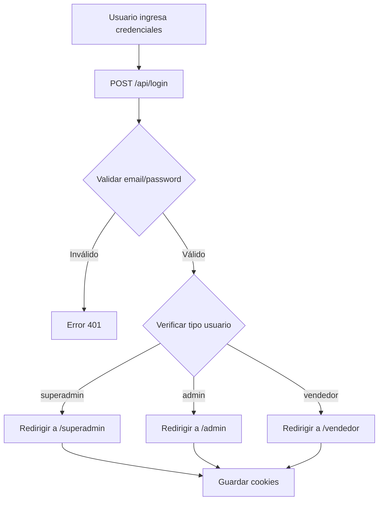

# 📊 Análisis Completo del Código - Sistema Punto de Venta RD

**Fecha de Análisis:** 2025-01-05  
**Versión del Proyecto:** 0.1.0  
**Framework:** Next.js 16.0.10

---

## 📋 Tabla de Contenidos

1. [Resumen Ejecutivo](#resumen-ejecutivo)
2. [Arquitectura General](#arquitectura-general)
3. [Stack Tecnológico](#stack-tecnológico)
4. [Estructura del Proyecto](#estructura-del-proyecto)
5. [Sistema de Autenticación y Autorización](#sistema-de-autenticación-y-autorización)
6. [Gestión de Datos](#gestión-de-datos)
7. [Funcionalidades Principales](#funcionalidades-principales)
8. [Análisis de Código](#análisis-de-código)
9. [Puntos Fuertes](#puntos-fuertes)
10. [Áreas de Mejora](#áreas-de-mejora)
11. [Recomendaciones](#recomendaciones)

---

## 🎯 Resumen Ejecutivo

### Descripción General
Sistema de punto de venta (POS) multi-empresa desarrollado con Next.js que permite gestionar ventas, inventario, compras, clientes y reportes. El sistema soporta tres tipos de usuarios: **superadmin**, **admin** y **vendedor**, cada uno con permisos y funcionalidades específicas.

### Características Principales
- ✅ Sistema multi-empresa con superadmin
- ✅ Gestión completa de productos, inventario y ventas
- ✅ Catálogos online B2C y B2B
- ✅ Impresión térmica (QZ Tray y ESC/POS)
- ✅ Sistema de roles y permisos
- ✅ Reportes y dashboard
- ✅ PWA (Progressive Web App) en desarrollo
- ✅ CI/CD automatizado con GitHub Actions

### Tecnologías Clave
- **Frontend:** Next.js 16 (App Router + Pages legacy), React 19
- **Backend:** Next.js API Routes
- **Base de Datos:** MySQL 8.0
- **Autenticación:** Cookies + bcrypt
- **Impresión:** QZ Tray, ESC/POS
- **Deployment:** VPS (Hostinger), PM2, NGINX

---

## 🏗️ Arquitectura General

### Patrón Arquitectónico
El proyecto utiliza una **arquitectura híbrida** que combina:
- **Next.js App Router** (nuevo) para rutas principales
- **Pages Router** (legacy) para compatibilidad con código existente
- **Server Components** y **Client Components** según necesidad

### Separación de Responsabilidades

```
┌─────────────────────────────────────────────────────────┐
│                    PRESENTACIÓN                         │
│  app/ (App Router) + _Pages/ (Pages Router legacy)     │
└─────────────────────────────────────────────────────────┘
                        ↕
┌─────────────────────────────────────────────────────────┐
│                    LÓGICA DE NEGOCIO                    │
│  _Pages/*/servidor.js (Server Actions)                  │
│  app/api/* (API Routes)                                 │
└─────────────────────────────────────────────────────────┘
                        ↕
┌─────────────────────────────────────────────────────────┐
│                    ACCESO A DATOS                       │
│  _DB/db.js (Connection Pool)                           │
│  MySQL Database                                         │
└─────────────────────────────────────────────────────────┘
```

### Flujo de Datos

1. **Cliente → Server Component/API Route**
2. **Server Action/API Route → Base de Datos**
3. **Base de Datos → Server Action/API Route**
4. **Server Action/API Route → Cliente**

---

## 💻 Stack Tecnológico

### Dependencias Principales

```json
{
  "next": "16.0.10",           // Framework principal
  "react": "19.2.1",            // Biblioteca UI
  "react-dom": "19.2.1",        // Renderizado React
  "mysql2": "^3.16.0",         // Driver MySQL
  "bcrypt": "^6.0.0",          // Hash de contraseñas
  "jsonwebtoken": "^9.0.3",   // Tokens JWT (usado parcialmente)
  "qz-tray": "^2.2.5",         // Impresión térmica
  "html2canvas": "^1.4.1",     // Captura de pantalla
  "xlsx": "0.20.3",            // Exportación Excel
  "react-barcode": "^1.6.1"    // Generación de códigos de barras
}
```

### Herramientas de Desarrollo

- **ESLint:** Linting de código
- **Babel React Compiler:** Optimización de React
- **PM2:** Process manager en producción
- **NGINX:** Reverse proxy y servidor web

---

## 📁 Estructura del Proyecto

### Organización de Carpetas

```
punto_de_venta_rd/
├── app/                      # Next.js App Router (nuevo)
│   ├── (admin)/              # Rutas protegidas para admin/vendedor
│   ├── (main)/               # Rutas públicas (login, registro)
│   ├── (superadmin)/         # Rutas protegidas para superadmin
│   ├── (vendedor)/           # Rutas protegidas para vendedor
│   ├── api/                  # API Routes
│   └── catalogo/             # Catálogos públicos
│
├── _Pages/                   # Pages Router (legacy)
│   ├── admin/                # Componentes y lógica admin
│   ├── main/                 # Componentes públicos
│   ├── superadmin/           # Componentes superadmin
│   ├── vendedor/             # Componentes vendedor
│   └── public/               # Componentes públicos
│
├── _DB/                      # Base de datos
│   ├── db.js                 # Connection pool MySQL
│   ├── tablas.sql            # Esquema de base de datos
│   └── migracion_*.sql       # Scripts de migración
│
├── services/                 # Servicios de negocio
│   └── imageService.js       # Gestión de imágenes
│
├── utils/                    # Utilidades
│   ├── escpos.js             # Comandos ESC/POS
│   ├── qzTrayService.js      # Servicio QZ Tray
│   ├── stockUtils.js         # Utilidades de stock
│   └── imageUtils.js         # Utilidades de imágenes
│
├── _EXTRAS/                  # Componentes auxiliares
│   ├── LadoCliente/          # Client wrapper
│   ├── Crear/                # Utilidades de creación
│   └── Imagenes/             # Componentes de imágenes
│
├── public/                    # Archivos estáticos
└── resource/                 # Recursos adicionales
```

### Convenciones de Nomenclatura

- **Componentes:** PascalCase (ej: `DashboardAdmin.js`)
- **Archivos de servidor:** `servidor.js` (dentro de cada módulo)
- **Estilos:** `*.module.css` (CSS Modules)
- **Rutas API:** `route.js` (Next.js App Router)

---

## 🔐 Sistema de Autenticación y Autorización

### Tipos de Usuario

1. **Superadmin**
   - Acceso a todas las empresas
   - Gestión de plataforma
   - Catálogo B2B de IsiWeek
   - No tiene `empresa_id` (es `NULL`)

2. **Admin**
   - Acceso a su empresa específica
   - Gestión completa de la empresa
   - Tiene `empresa_id` asignado

3. **Vendedor**
   - Acceso limitado a su empresa
   - Permisos restringidos
   - Tiene `empresa_id` asignado

### Flujo de Autenticación



### Implementación de Seguridad

#### 1. **Autenticación**
- **Archivo:** `_Pages/main/login/servidor.js`
- **Método:** Email + Password
- **Hash:** bcrypt (salting automático)
- **Sesión:** Cookies HTTP-only

```javascript
// Cookies configuradas
cookieStore.set('userId', usuario.id, {
    httpOnly: true,
    secure: process.env.NODE_ENV === 'production',
    sameSite: 'lax',
    maxAge: 60 * 60 * 24 * 7  // 7 días
})
```

#### 2. **Autorización por Ruta**
- **Archivo:** `app/(admin)/admin/layout.js`
- **Archivo:** `app/(superadmin)/superadmin/layout.js`

```javascript
// Protección en layout
const userTipo = cookieStore.get('userTipo')?.value

if (userTipo !== 'admin' && userTipo !== 'vendedor') {
    redirect('/login')
}
```

#### 3. **Validación en Server Actions**
- Cada `servidor.js` valida permisos antes de ejecutar operaciones
- Verificación de `empresa_id` para admin/vendedor
- Verificación de `tipo` para superadmin

### Puntos de Mejora en Seguridad

⚠️ **Problemas Identificados:**

1. **Cookies sin SameSite Strict**
   - Actual: `sameSite: 'lax'`
   - Recomendado: `sameSite: 'strict'` para mayor seguridad

2. **Falta de CSRF Protection**
   - No hay tokens CSRF implementados
   - Recomendado: Implementar protección CSRF

3. **JWT No Utilizado Completamente**
   - Se importa `jsonwebtoken` pero no se usa consistentemente
   - Las cookies son el método principal de autenticación

4. **Validación de Permisos Inconsistente**
   - Algunos módulos validan permisos, otros no
   - Recomendado: Middleware centralizado de autorización

---

## 💾 Gestión de Datos

### Conexión a Base de Datos

**Archivo:** `_DB/db.js`

```javascript
import mysql from 'mysql2/promise';

const db = mysql.createPool({
  host: process.env.DB_HOST,
  port: Number(process.env.DB_PORT),
  user: process.env.DB_USER,
  password: process.env.DB_PASSWORD,
  database: process.env.DB_NAME,
});

export default db;
```

**Características:**
- ✅ Connection Pool (mejor rendimiento)
- ✅ Variables de entorno (seguridad)
- ✅ Soporte para múltiples conexiones simultáneas

### Modelo de Datos Principal

#### Tablas Core

1. **empresas**
   - Información de empresas clientes
   - Configuración de catálogo
   - Datos fiscales (RNC, etc.)

2. **usuarios**
   - Autenticación y autorización
   - Relación con empresas
   - Tipos: superadmin, admin, vendedor

3. **productos**
   - Catálogo de productos
   - Precios, stock, imágenes
   - Relación con categorías y marcas

4. **ventas**
   - Transacciones de venta
   - Relación con clientes y usuarios
   - Métodos de pago

5. **movimientos_inventario**
   - Historial de cambios de stock
   - Tipos: entrada, salida, ajuste, devolución, merma

6. **clientes**
   - Información de clientes
   - Historial de compras
   - Créditos y deudas

#### Relaciones Clave

```
empresas (1) ──< (N) usuarios
empresas (1) ──< (N) productos
empresas (1) ──< (N) ventas
productos (1) ──< (N) movimientos_inventario
clientes (1) ──< (N) ventas
```

### Patrones de Acceso a Datos

#### 1. **Server Actions** (Recomendado)
```javascript
// _Pages/admin/productos/servidor.js
export async function obtenerProductos() {
    const connection = await db.getConnection()
    try {
        const [productos] = await connection.execute(
            'SELECT * FROM productos WHERE empresa_id = ?',
            [empresaId]
        )
        return productos
    } finally {
        connection.release()
    }
}
```

#### 2. **API Routes**
```javascript
// app/api/login/route.js
export async function POST(request) {
    const body = await request.json()
    // ... lógica de autenticación
    return NextResponse.json({ success: true })
}
```

### Gestión de Transacciones

⚠️ **Problema Identificado:**
- No se utilizan transacciones explícitas en operaciones críticas
- Ejemplo: Crear venta + actualizar stock debería ser atómico

**Recomendación:**
```javascript
const connection = await db.getConnection()
await connection.beginTransaction()

try {
    await connection.execute('INSERT INTO ventas ...')
    await connection.execute('UPDATE productos SET stock = ...')
    await connection.commit()
} catch (error) {
    await connection.rollback()
    throw error
} finally {
    connection.release()
}
```

---

## 🎨 Funcionalidades Principales

### 1. Gestión de Productos

**Ubicación:** `app/(admin)/admin/productos/`

**Características:**
- ✅ CRUD completo de productos
- ✅ Gestión de imágenes (local y remoto)
- ✅ Códigos de barras y SKU
- ✅ Control de stock (mínimo, máximo)
- ✅ Precios: compra, venta, oferta, mayorista
- ✅ Categorización y marcas

**Servicios Relacionados:**
- `services/imageService.js` - Gestión de imágenes
- `utils/stockUtils.js` - Utilidades de stock

### 2. Sistema de Ventas

**Ubicación:** `app/(admin)/admin/ventas/`

**Características:**
- ✅ Crear ventas con múltiples productos
- ✅ Métodos de pago: efectivo, tarjeta, transferencia
- ✅ Cálculo automático de ITBIS
- ✅ Descuentos y extras
- ✅ Impresión de tickets (QZ Tray + ESC/POS)
- ✅ Gestión de pedidos pendientes

**Flujo de Venta:**
1. Seleccionar productos
2. Agregar cliente (opcional)
3. Aplicar descuentos
4. Seleccionar método de pago
5. Registrar venta
6. Actualizar stock automáticamente
7. Imprimir ticket

### 3. Gestión de Inventario

**Ubicación:** `app/(admin)/admin/inventario/`

**Características:**
- ✅ Visualización de stock actual
- ✅ Movimientos de inventario (entrada, salida, ajuste)
- ✅ Historial completo de movimientos
- ✅ Alertas de stock bajo
- ✅ Reportes de inventario

**Tipos de Movimiento:**
- `entrada` - Aumenta stock
- `salida` - Disminuye stock
- `ajuste` - Corrige stock
- `devolucion` - Aumenta stock
- `merma` - Disminuye stock (pérdidas)

### 4. Catálogos Online

#### Catálogo B2C (Público)
**Ubicación:** `app/catalogo/[slug]/`

**Características:**
- ✅ Catálogo público por empresa
- ✅ URL personalizada (`/c/{slug}`)
- ✅ Sin necesidad de login
- ✅ Checkout público
- ✅ Integración con WhatsApp

#### Catálogo B2B (IsiWeek)
**Ubicación:** `app/(superadmin)/superadmin/tienda-b2b/`

**Características:**
- ✅ Tienda privada para empresas
- ✅ Login requerido
- ✅ Productos de IsiWeek
- ✅ Pedidos B2B

### 5. Sistema de Impresión

**Archivos:**
- `utils/qzTrayService.js` - Servicio QZ Tray
- `utils/escpos.js` - Comandos ESC/POS

**Características:**
- ✅ Impresión térmica (80mm, 58mm)
- ✅ Detección automática de impresoras
- ✅ Formato de tickets personalizable
- ✅ Soporte para múltiples impresoras

**Formato de Ticket:**
- Información de empresa
- Datos de venta (NCF, número)
- Productos con cantidades y precios
- Totales (subtotal, ITBIS, total)
- Método de pago
- Mensaje personalizado

### 6. Dashboard y Reportes

**Ubicación:** `app/(admin)/admin/dashboard/`

**Métricas Incluidas:**
- Ventas del día/mes
- Productos más vendidos
- Stock bajo
- Ventas por vendedor
- Gráficos y estadísticas

### 7. Gestión de Usuarios

**Ubicación:** `app/(admin)/admin/usuarios/`

**Características:**
- ✅ CRUD de usuarios
- ✅ Asignación de roles
- ✅ Activación/desactivación
- ✅ Gestión de permisos

---

## 🔍 Análisis de Código

### Calidad del Código

#### ✅ Puntos Fuertes

1. **Separación de Responsabilidades**
   - Server Actions separados de componentes
   - Utilidades reutilizables
   - Servicios centralizados

2. **Manejo de Errores**
   - Try-catch en operaciones críticas
   - Liberación de conexiones en finally
   - Mensajes de error descriptivos

3. **Reutilización**
   - Componentes compartidos (`ClienteWrapper`)
   - Utilidades comunes (`stockUtils`, `imageUtils`)
   - Servicios centralizados (`imageService`)

4. **Documentación**
   - Archivos MD con metodologías
   - Comentarios en código crítico
   - Guías de despliegue

#### ⚠️ Áreas de Mejora

1. **Inconsistencias Arquitectónicas**
   - Mezcla de App Router y Pages Router
   - Algunos módulos usan Server Actions, otros API Routes
   - **Recomendación:** Migrar completamente a App Router

2. **Validación de Datos**
   - Validación inconsistente en formularios
   - No hay validación de esquemas (Zod, Yup)
   - **Recomendación:** Implementar validación con Zod

3. **Manejo de Estado**
   - Uso excesivo de `useState` local
   - No hay estado global (Context/Redux)
   - **Recomendación:** Considerar Context API o Zustand

4. **Testing**
   - No hay tests unitarios
   - No hay tests de integración
   - **Recomendación:** Implementar Jest + React Testing Library

5. **TypeScript**
   - Proyecto completamente en JavaScript
   - **Recomendación:** Migrar gradualmente a TypeScript

### Análisis de Seguridad

#### ✅ Implementado Correctamente

1. **Hash de Contraseñas**
   ```javascript
   const hashedPassword = await bcrypt.hash(password, 10)
   ```

2. **Protección de Rutas**
   - Layouts verifican permisos
   - Redirecciones automáticas

3. **Variables de Entorno**
   - Credenciales en `.env`
   - No expuestas en código

#### ⚠️ Vulnerabilidades Potenciales

1. **SQL Injection**
   - Uso de prepared statements ✅
   - Pero falta validación de inputs

2. **XSS (Cross-Site Scripting)**
   - No hay sanitización de inputs
   - **Recomendación:** Usar `DOMPurify` o similar

3. **CSRF**
   - No hay protección CSRF
   - **Recomendación:** Implementar tokens CSRF

4. **Rate Limiting**
   - No hay límite de intentos de login
   - **Recomendación:** Implementar rate limiting

### Rendimiento

#### ✅ Optimizaciones Implementadas

1. **Connection Pooling**
   - Reutilización de conexiones MySQL

2. **Image Optimization**
   - Next.js Image component (parcialmente)

3. **Code Splitting**
   - Next.js automático

#### ⚠️ Oportunidades de Mejora

1. **Caché de Consultas**
   - No hay caché de consultas frecuentes
   - **Recomendación:** Implementar Redis o caché en memoria

2. **Lazy Loading**
   - Algunos componentes no usan lazy loading
   - **Recomendación:** Usar `React.lazy()` para componentes grandes

3. **Optimización de Imágenes**
   - Imágenes no optimizadas completamente
   - **Recomendación:** Usar Next.js Image component consistentemente

---

## 💪 Puntos Fuertes

1. **Funcionalidad Completa**
   - Sistema POS completo y funcional
   - Todas las características esenciales implementadas

2. **Arquitectura Escalable**
   - Multi-empresa desde el diseño
   - Separación clara de responsabilidades

3. **Documentación Extensa**
   - Guías de despliegue
   - Metodologías documentadas
   - Soluciones a problemas comunes

4. **Integraciones Útiles**
   - QZ Tray para impresión
   - Catálogos online
   - Exportación a Excel

5. **CI/CD Implementado**
   - GitHub Actions configurado
   - Deploy automatizado

---

## 🔧 Áreas de Mejora

### Críticas (Alta Prioridad)

1. **Seguridad**
   - [ ] Implementar protección CSRF
   - [ ] Sanitizar inputs (prevenir XSS)
   - [ ] Rate limiting en login
   - [ ] Validación de esquemas (Zod)

2. **Transacciones de Base de Datos**
   - [ ] Usar transacciones en operaciones críticas
   - [ ] Rollback automático en errores

3. **Manejo de Errores**
   - [ ] Logging centralizado
   - [ ] Manejo de errores consistente
   - [ ] Mensajes de error user-friendly

### Importantes (Media Prioridad)

4. **Testing**
   - [ ] Tests unitarios (Jest)
   - [ ] Tests de integración
   - [ ] Tests E2E (Playwright)

5. **TypeScript**
   - [ ] Migración gradual a TypeScript
   - [ ] Tipos para base de datos
   - [ ] Tipos para API

6. **Optimización**
   - [ ] Caché de consultas (Redis)
   - [ ] Lazy loading de componentes
   - [ ] Optimización de imágenes

### Mejoras (Baja Prioridad)

7. **Código**
   - [ ] Estandarizar convenciones
   - [ ] Eliminar código duplicado
   - [ ] Refactorizar componentes grandes

8. **UX/UI**
   - [ ] Mejorar feedback visual
   - [ ] Loading states consistentes
   - [ ] Mejor manejo de errores en UI

---

## 📝 Recomendaciones

### Corto Plazo (1-2 meses)

1. **Implementar Validación con Zod**
   ```javascript
   import { z } from 'zod'
   
   const productoSchema = z.object({
     nombre: z.string().min(1).max(200),
     precio_venta: z.number().positive(),
     stock: z.number().int().min(0)
   })
   ```

2. **Agregar Transacciones**
   - En creación de ventas
   - En movimientos de inventario
   - En actualizaciones críticas

3. **Mejorar Seguridad**
   - CSRF tokens
   - Sanitización de inputs
   - Rate limiting

### Mediano Plazo (3-6 meses)

4. **Migrar a TypeScript**
   - Empezar con tipos de base de datos
   - Tipos para API routes
   - Tipos para componentes

5. **Implementar Testing**
   - Tests unitarios para utilidades
   - Tests de integración para API
   - Tests E2E para flujos críticos

6. **Optimizar Rendimiento**
   - Implementar caché (Redis)
   - Optimizar consultas SQL
   - Lazy loading

### Largo Plazo (6+ meses)

7. **Refactorización Arquitectónica**
   - Migrar completamente a App Router
   - Implementar estado global
   - Separar mejor frontend/backend

8. **Nuevas Funcionalidades**
   - PWA completo
   - Notificaciones push
   - App móvil nativa

---

## 📊 Métricas del Proyecto

### Tamaño del Código
- **Líneas de código:** ~15,000+ (estimado)
- **Componentes React:** ~50+
- **API Routes:** ~10+
- **Server Actions:** ~30+
- **Tablas de BD:** ~20+

### Complejidad
- **Arquitectura:** Media-Alta
- **Mantenibilidad:** Media
- **Escalabilidad:** Alta
- **Seguridad:** Media (mejorable)

---

## 🎯 Conclusión

El sistema de punto de venta es **funcional y completo**, con una base sólida para un sistema POS multi-empresa. Tiene características avanzadas como catálogos online, impresión térmica y gestión completa de inventario.

**Principales Logros:**
- ✅ Sistema completo y funcional
- ✅ Arquitectura escalable
- ✅ Documentación extensa
- ✅ CI/CD implementado

**Principales Oportunidades:**
- ⚠️ Mejorar seguridad (CSRF, XSS, rate limiting)
- ⚠️ Implementar testing
- ⚠️ Migrar a TypeScript
- ⚠️ Optimizar rendimiento

**Recomendación General:**
El proyecto está en un buen estado para producción, pero se beneficiaría significativamente de mejoras en seguridad, testing y optimización. Las mejoras sugeridas pueden implementarse gradualmente sin afectar la funcionalidad actual.

---

**Última actualización:** 2025-01-05  
**Analizado por:** AI Code Analysis

